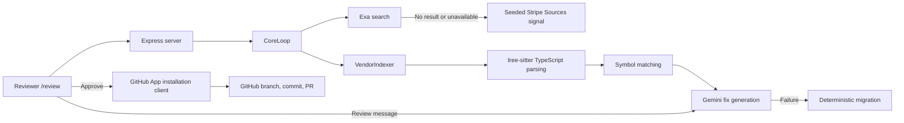

# Breaking Change Guardian — Current Architecture

## Purpose

Breaking Change Guardian is a TypeScript/Node hackathon demo that detects a likely Stripe SDK breaking change from the open web, finds affected TypeScript call sites, proposes a Gemini-generated migration, and lets a reviewer approve a GitHub App pull request.

The active demo page is `/review`.

## Active request path



## Components

| Area | Main files | Responsibility |
| --- | --- | --- |
| HTTP/UI | `src/server.ts`, `src/views/review.ts` | Serves the review page and on-demand API. |
| Orchestration | `src/services/pipeline/core_loop.ts` | Runs detection → indexing → matching → migration → optional PR. |
| Detection | `src/services/detector/exa_detector.ts` | Uses Exa search, then falls back to a known Stripe migration signal. |
| Indexing | `src/services/indexer/vendor_indexer.ts`, `tree_sitter_indexer.ts` | Parses local TypeScript/TSX source and extracts Stripe SDK calls. |
| AI | `src/services/fixer/gemini_fix_generator.ts` | Uses Gemini for minimal patches and conversational revisions. |
| GitHub | `src/services/github/app.ts`, `pr_service.ts` | Stores installation IDs, obtains ephemeral installation tokens, clones on push, and creates PRs. |
| Data | `src/db/*` | Optional Postgres/Supabase/PGlite persistence for legacy workflow and GitHub installation records. |

## P0: Stripe demo loop

`POST /api/demo/run` and `POST /api/review/start` use the checked-in fixture at `repos/stripe-demo`.

The fixture contains:

- `src/checkout.ts`: direct `stripe.sources.create(...)` call.
- `src/legacyPayments.ts`: one-level alias (`paymentsClient`) using the same call.
- `package.json`: a deliberately old Stripe SDK version, only for static-analysis realism.

The indexer identifies the direct call and simple alias. The matcher correlates both with `stripe.sources.create`. The first matching call is sent to Gemini; if Gemini is unavailable, deterministic rules create the fallback patch.

## Exa and Gemini behavior

- `EXA_API_KEY` enables live web discovery. The detector returns `live: true` only for a usable Exa result.
- The seed remains available for rehearsals and reports `live: false`.
- `GEMINI_API_KEY` enables both patch generation and review chat.
- `GEMINI_FIX_MODEL` selects the model. The current default is `gemini-3.6-flash`, because `gemini-2.5-flash` was rejected for this project during validation.
- A failed/malformed Gemini response does not stop the demo: deterministic rules generate the patch.

## GitHub App flow

No personal access token is used by the active PR flow.

1. `GET /api/github/install` redirects to the App installation URL from `GITHUB_APP_SLUG`.
2. GitHub redirects to `GET /api/github/callback?installation_id=...` after installation.
3. The server persists only the installation ID in `github_installations`; it does not persist an access token.
4. `GitHubAppService` obtains short-lived installation credentials from the App ID and private key when needed.
5. `GitHubPrService` uses installation-authenticated Octokit to create the branch, update the exact source line, and open the PR.

PR creation is additionally gated by `OPEN_PR=true`. Otherwise approval returns a preview result and makes no external write.

The webhook receiver verifies `GITHUB_APP_WEBHOOK_SECRET`. On `push`, it clones the approved repository with an ephemeral installation token, runs the Stripe scan, returns the detection result, and deletes the temporary clone. A push never opens a PR automatically.

## P1 review dashboard

`/review` is a custom single-page HTML/CSS/JavaScript review surface. It shows the signal, matched snippets, patch, explanation, Gemini chat, and approve action.

Review sessions are an in-memory map, so they are lost on server restart. CopilotKit is not installed: its onboarding command did not produce a usable package or integration files. The custom Gemini chat remains the working P1 fallback.

## Legacy code retained

The older `/dashboard` route and its `changelog/`, `matcher/`, `fix_generator.ts`, `repo_indexer.ts`, and `ai/gemini_service.ts` modules implement a database-backed Stripe workflow. They are not used by the active `/review` demo flow and still contain a simulated legacy PR endpoint. Treat `/review` and `CoreLoop` as the current demo architecture.

## Environment variables

| Variable | Purpose |
| --- | --- |
| `EXA_API_KEY` | Live Exa detection. |
| `GEMINI_API_KEY` | Gemini patch generation and review conversation. |
| `GEMINI_FIX_MODEL` | Optional Gemini model override. |
| `GITHUB_APP_ID` | GitHub App identifier. |
| `GITHUB_APP_PRIVATE_KEY` | PEM value; escape newlines when storing it in `.env`. |
| `GITHUB_APP_WEBHOOK_SECRET` | Webhook signature verification. |
| `GITHUB_APP_SLUG` | Builds the App installation URL. |
| `GITHUB_REPO` | `owner/repository` destination for an approved PR. |
| `GITHUB_BASE` | Base branch; defaults to `main`. |
| `OPEN_PR` | Must be `true` to permit a real PR. |
| `DATABASE_URL` | Optional Postgres; PGlite is used locally otherwise. |

`.env`, PEM files, generated output, and local cache/database files are excluded by `.gitignore`.

## Important limitations

1. The review UI indexes the checked-in local Stripe fixture; remote repo cloning is currently exercised by the webhook path, not selectable through the UI.
2. The demo patch is a one-line replacement and is not type-checked in an isolated checkout before PR creation.
3. There is no Ambiguous MCP connector in this environment, so P2 task creation is not implemented.
4. CopilotKit is not installed after onboarding produced no usable project changes; review chat is custom Gemini-backed.

## Commands

```powershell
npm run build
npm run demo:stripe
npm run dev
```

Then open `http://localhost:3000/review`.
